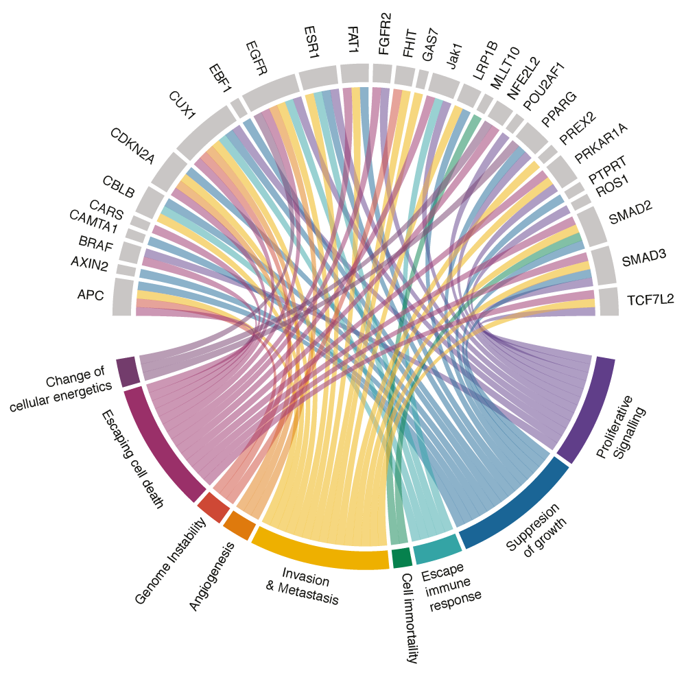
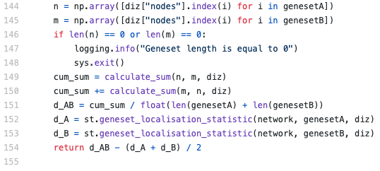
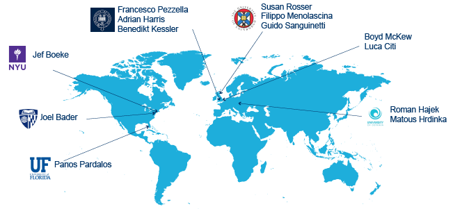

The 2016 UK synthetic biology strategic plan recognised the potential of
synthetic biology in addressing problems in medicine by engineering mammalian
cells for immunotherapy, drug delivery and emulate tissues and organs. This is
an attractive approach for cancer biology; indeed, synthetic mammalian cells
could provide a robust, predictable model to test the functional impact of
cancer mutations, compared to inaccurate cell lines or animal models. 

Our long-term goal is to develop enabling computational technologies to design
synthetic genomes and machine learning methods to identify genes and pathways
associated with cancer.

    

        <h2>Synthetic genomics</h2>
    

    

        
    

    

        Whole genome engineering has become possible thanks to recent advances in 
        DNA synthesis technologies and Computer Aided Design (CAD) methods. 
        We pioneered CAD software for synthetic genome engineering 
        (<a href="/publications#Stracquadanio2017">Science, 2017</a>), 
        which has been instrumental to design the synthetic yeast genome 
        (<a href="http://www.syntheticyeast.org">Saccharomyces cerevisiae 2.0</a>, Sc2.0)
        the first synthetic eukaryotic genome ever built. 
        The synthetic yeast genome allows us to address a number of open questions 
        in genome biology, including the identification of a minimal eukaryotic genome 
        compatible with life (<a href="/publications#stracquadanio2016">Genome Research,
        2016</a>). 

        Synthetic chromosomes represent a powerful tool to integrate synthetic pathways
        into industrial expression systems. However, the design principles to build new, 
        functional chromosomes are mostly unknown, and the current technology limits the DNA 
        molecules that can be synthesized (<a href="/publications#stracquadanio2019-4">Science, 2019</a>). 
        We are addressing these issues by developing statistical models to learn how wild-type 
        genomes change upon the integration of synthetic chromosomes, and by developing methods
        to optimise manufacturing of chromosome scale molecules, by repositioning mathematical 
        programming methods we developed for electronic engineering.  
    

    <!-- rare diseases -->
    

        <h2>Synthetic human enzyme engineering</h2>
    

    

        Enzymes are natural catalysts able to accelerate almost any reaction are 
        building blocks of cellular life. Enzymatic deficiencies are usually associated 
        with devastating rare diseases, which can only be treated by providing 
        the defective enzyme through intravenous injections. However, enzymes loose 
        catalytic activity in blood and often cause a severe immune response; moreover,
        current manufacturing technologies have low yield, which dramatically raises the cost of 
        treatment. 

        Here we are building on our expertise in machine learning and synthetic genomics 
        to design and build human enzymes at scale. Our goal is to establish technologies 
        to optimise the therapeutic properties of synthetic enzymes and to engineer 
        expression systems for inexpensive production of these molecules. 
    

    

        
    

    <!-- cancer genetics and genomics -->
    

        <h2>Cancer genetics and genomics</h2>
    

    

        
    

    

        Decades of research have shown that genomic mutations in key genic regions 
        are responsible for the transformation of normal cells into cancer cells.
        However, while a causal role for somatic mutations has been shown for many 
        common malignancies, the role of high frequency inherited mutations has 
        remained elusive (<a href="/publications/stracquadanio2020-2">Seminars in cancer biology, 2020</a>). 
        Moreover, since cancer is a strongly polygenic disease, 
        finding aberrant pathways is a critical step to understand the aetiology 
        of this disease and identify new targets for treatment. 

        We are addressing these issue by developing statistical learning methods
        to to dissect the heritable risk of cancer at the gene 
        (<a href="/publications#stracquadanio2019">biorXiv, 2019</a>) and pathway 
        level (<a href="/publications#stracquadanio2016-nature">Nature Rev Cancer, 2016</a>). 
        Now, we are extending our framework with deep graph neural networks to integrate transcriptomic and proteomic 
        data to infer aberrant pathways involved in cancer metabolism and affecting response to therapy. 

        While causal somatic mutations has been identified for many cancers, the genomic 
        landscape of rare tumours is mostly unknown. In collaboration with Blood Cancer Research Group 
        at University of Ostrava, we are studying the genome of rare blood cancers, including 
        multiple myeloma minimal residual disease and extramedullary myeloma. 
        
    

    <!-- computational biology algorithms and software engineering -->
    

        <h2>Computational biology algorithms and software engineering</h2>
    

    

    Computational methods are now cornerstone of many biological experiments. The
    lab is committed to release high-quality, open-source tools that can be
    easily integrated into analysis workflows. To do that, we adopt software
    engineering principles and methods that are standard in industry. Currently,
    our ecosystem relies on Python, Git, GitHub and GPU computing libraries. 
    All our analyses are implemented using either Nextflow or Snakemake
    workflow management systems. We also maintain a collection of Docker containers 
    to facilitate the adoption of our tools. You can check our growing suite of software on
    GitHub.
    

    

        
    

<!-- ## Cancer biology

    
    
Cancer heritability genes associated with the hallmarks of cancer (Fanfani et al, 2019).

 
 

## Research software engineering
Computational methods are now cornerstone of many biological experiments. The
lab is committed to release high-quality, open-source tools that can be easily
integrated into analysis workflows. To do that, we adopt software engineering
principles and methods that are standard in industry. Currently, our ecosystem
relies predominantly on Python, Git and Circle CI for continuos integration. All
our analyses are implemented using the
[Snakemake](https://snakemake.readthedocs.io/en/stable/) workflow management
system. You can check our growing suite of software on
[GitHub](https://github.com/stracquadaniolab).

## Our collaborators

    

 -->