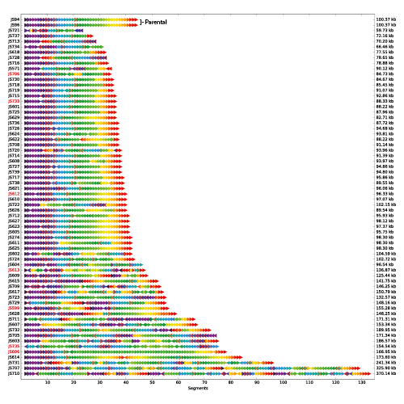

The 2016 UK synthetic biology strategic plan recognised the potential of synthetic biology in addressing problems in medicine by engineering mammalian cells for immunotherapy, drug delivery and emulate tissues and organs. This is an attractive approach for cancer biology; indeed, synthetic mammalian cells could provide a robust, predictable model to test the functional impact of cancer mutations, compared to inaccurate cell lines or animal models. 

Our long-term goal is to develop enabling computational technologies to design synthetic genomes and machine learning methods to identify genes and pathways associated with cancer.

## Synthetic genomics

    
    
Rearrangements observed in synIXR strains  (Shen, Stracquadanio, Wang et al, Genome research, 2016).

Whole genome design has been recently possible using Computer Aided Design (CAD) methods. We pioneered CAD software for synthetic genome engineering, such as BioStudio [[Science, 2017]](/publications#Stracquadanio2017), which we used to build the first synthetic eukaryotic genome, *Saccharomyces cerevisiae 2.0* [(Sc2.0)](http://www.syntheticyeast.org). The synthetic yeast genome allows us to address a number of questions in genome biology, including the identification of a minimal eukaryotic genome compatible with life [[Genome Research, 2016](/publications#stracquadanio2016)].

Now, we aim at scaling these technologies to design mammalian genomes. We are currently developing methods to optimise the manufacturing of chromosome scale DNA molecules, repositioning mathematical programming methods we developed for electronic engineering. We work in close collaboration with the [Edinburgh Genome Foundry](https://www.genomefoundry.org) to implement an integrated design-build-test-learn framework. 

 
 

## Cancer biology

    
    
Cancer heritability genes associated with the hallmarks of cancer (Fanfani et al, 2019).

To maximize the utility of synthetic mammalian cells as a platform for cancer studies, we need to identify meaningful biological units, such as genes and pathways, that can be synthesized into chromosomes and screened for functional impact. Machine learning (ML) methods provide unique opportunities to identify such units by taking advantage of big data generated by cancer sequencing projects. 

Recently, we used statistical learning methods to dissect the genetic architecture of cancer at the gene [[biorXiv, 2019]](/publications#stracquadanio2019) and pathway level [[Nature Rev Cancer, 2016]](/publications#stracquadanio2016-nature). Now, we are extending our framework to integrate transcriptomic and proteomic data to infer aberrant pathways involved in cancer metabolism and affecting response to therapy.

 
 

## Research software engineering
Computational methods are now cornerstone of many biological experiments. The lab is committed to release high-quality, open-source tools that can be easily integrated into analysis workflows. To do that, we adopt software engineering principles and methods that are standard in industry. Currently, our ecosystem relies predominantly on Python, Git and Circle CI for continuos integration. All our analyses are implemented using the [Snakemake](https://snakemake.readthedocs.io/en/stable/) workflow management system. You can check our growing suite of software on [GitHub](https://github.com/stracquadaniolab).

## Our collaborators

    

